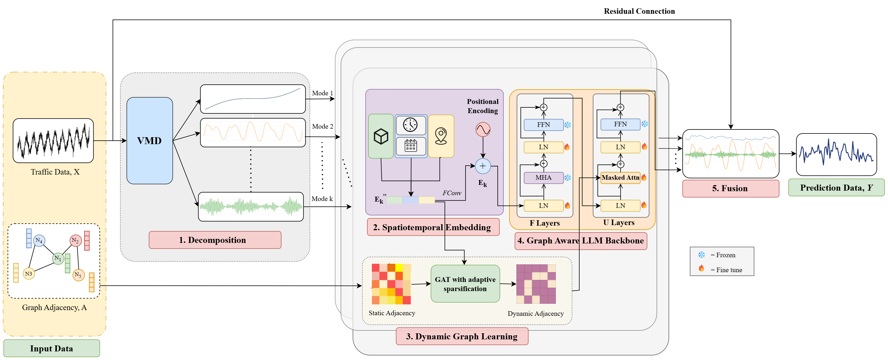

# DG-LLM: Decomposition-based Dynamic Graph Adaptation of Large Language Models for Spatiotemporal Traffic Forecasting

## Abstract

Traffic forecasting plays a critical role in the field of urban planning. Yet, existing methods struggle with modeling complicated spatiotemporal dependencies and capturing long-term patterns due to their multiscale nature. In this paper, we present a novel framework named DG-LLM that leverages the advantages of decomposed temporal representations and adaptive spatial connectivity to model spatiotemporal dependencies. In this framework, traffic signals are decomposed into intrinsic modes, and dynamic graphs are learned for each mode to represent the spatial dependencies. These representations are then incorporated with pre-trained Large Language Models for effective long-range temporal dependency modeling.  We conducted comprehensive experiments across six real-world traffic datasets spanning urban mobility systems and highway traffic networks and evaluated short- and long-term forecasting. Experimental results demonstrate that our framework provides significant improvements over state-of-the-art approaches, including benchmark graph- and LLM-based spatiotemporal forecasting models, even in long-term forecasting scenarios with severe temporal instability. Our model outperforms other methods by achieving $13-19\%$ improvements in MAE and $19-25\%$ in RMSE across all six benchmarks compared with baseline approaches. Additional analyses, including ablation studies, robustness to missing data, and zero-shot cross-dataset evaluation, further validate the effectiveness and generalization capability of the proposed framework.

## Architecture



## Key Features

- **VMD**: Per-sample decomposition (no data leakage between train/val/test)
- **Dynamic Graph Learning**: Learned adjacency via multi-head GAT with curriculum learning
- **Pretrained LLM Backbone**: Pre-trained LLM adapted for time series with LoRA fine-tuning

## How to Run

1. **Install Dependencies**:

   ```bash
   pip install -r requirements.txt
   ```

2. **Prepare Data**:
   - Download datasets from the link below
   - Extract to `./Dataset/<dataset_name>/`
   - Each dataset folder should contain:
     - `adj_mx.pkl` - Adjacency matrix
     - `processed/` folder with `train.npz`, `val.npz`, `test.npz`

3. **Run Training**:

   ```bash
   python main.py
   ```

## Dataset Download

The datasets are available on Google Drive: **[Datasets](https://drive.google.com/file/d/19LkZXBCS7E2SCuM2ZQ7YKT7L0-wMXrJa/view?usp=sharing)**

## Dataset Format

```text
Dataset/
|-- PEMSD04/
|   |-- adj_mx.pkl          # Adjacency matrix [307, 307]
|   `-- processed/
|       |-- train.npz       # x: [Samples, 12, 307, F], y: [Samples, 12, 307, 1]
|       |-- val.npz
|       `-- test.npz
|-- PEMSD08/                # 170 nodes
|-- bike_drop/              # 250 nodes
|-- bike_pick/              # 250 nodes
|-- taxi_drop/              # 266 nodes
`-- taxi_pick/              # 266 nodes
```

## Run on Kaggle

[](https://www.kaggle.com/code/sadia1216/dgllm)

### Run Different Input-Output Horizons

- 12-12 (default):

   ```bash
   python main.py --data PEMSD04 --input_len 12 --output_len 12
   ```

- 48-96:

   ```bash
   python main.py --data PEMSD04 --input_len 48 --output_len 96
   ```

## Acknowledgements

This project is built upon the work of [ST-LLM](https://github.com/ChenxiLiu-HNU/ST-LLM). We thank the authors for providing the base code and datasets.

## Citation

Paper is currently under review. Citation information will be updated upon publication.
